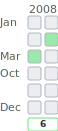
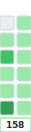
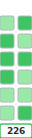
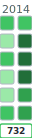
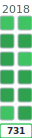
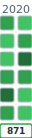
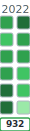
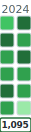
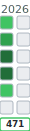
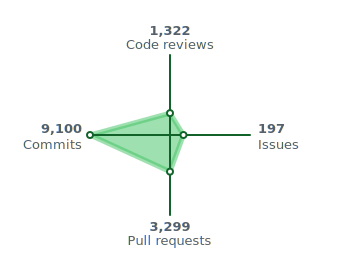

#  Hi, I'm Keenan

<!-- CONTRIBUTIONS BEGIN -->
14,306 contributions in total

<table><tr><td valign="top">

**Contributed to**
 [manageiq](https://github.com/ManageIQ/manageiq)
 [ancestry](https://github.com/stefankroes/ancestry)
 [active_hash](https://github.com/active-hash/active_hash)
 [optimist](https://github.com/ManageIQ/optimist)
 [virtual_attributes](https://github.com/ManageIQ/activerecord-virtual_attributes)
 [floe](https://github.com/ManageIQ/floe)
 [ruport](https://github.com/ruport/ruport)
 [rails](https://github.com/rails/rails)
and 260 other repositories

</td><td>

</td></tr></table>

**Projects** (p list)

 [manageiq](https://github.com/ManageIQ/manageiq) 
 [ancestry](https://github.com/stefankroes/ancestry) 
 [active_hash](https://github.com/active-hash/active_hash) 
 [optimist](https://github.com/ManageIQ/optimist) 
 [virtual_attributes](https://github.com/ManageIQ/activerecord-virtual_attributes) 
 [floe](https://github.com/ManageIQ/floe) 
 [ruport](https://github.com/ruport/ruport) 
 [rails](https://github.com/rails/rails) 
and 260 other repositories

**Projects** (table)

| | Project | |
|:-|---------|:-|
|  | [manageiq](https://github.com/ManageIQ/manageiq) |  |
|  | [ancestry](https://github.com/stefankroes/ancestry) |  |
|  | [active_hash](https://github.com/active-hash/active_hash) |  |
|  | [optimist](https://github.com/ManageIQ/optimist) |  |
|  | [virtual_attributes](https://github.com/ManageIQ/activerecord-virtual_attributes) |  |
|  | [floe](https://github.com/ManageIQ/floe) |  |
|  | [ruport](https://github.com/ruport/ruport) |  |
|  | [rails](https://github.com/rails/rails) |  |
| | and 260 other repositories | |
<!-- CONTRIBUTIONS END -->

